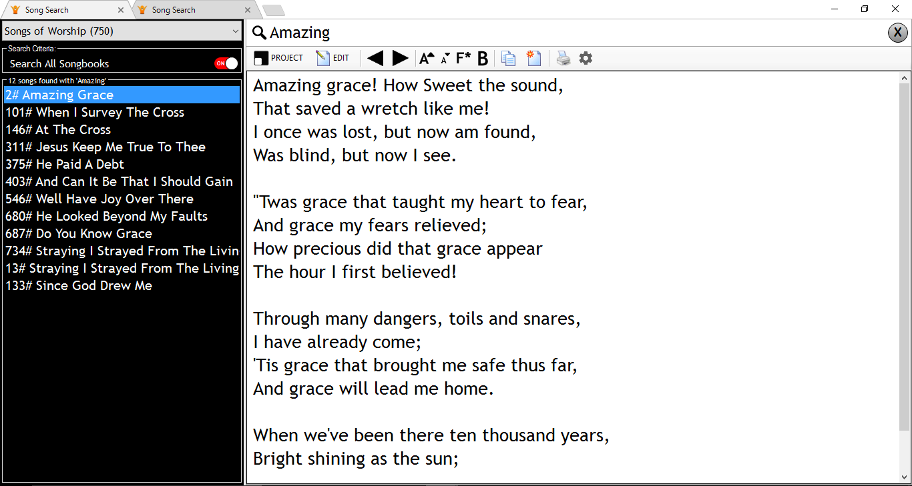

# vSongBook Desktop for Windows
vSongBook is an app that seeks to give its users the freedom to be sing anywhere anytime provided they have the latest version installed on their device. This is the respiratory for vSongBook built for Windows Machine using Visual Studio 2017 and Sqlite database to make it faster and reliable

## Features in this package
This version of vSongBook unlike its predeseccors comes with a number of new features as you will learn with time.
### 1. Tabbed Windows Viewing (Updated)
This is old feature but revampered with a chrome like user interface to make it look nice. You can search for songs in multiple tabs, manage your preferences, manage your songbooks, manage your songs easily like switching between sites on your favourite browser!

### 2. Custom Preferences (Updated)
From the Song Search tab you can click the gear button and open the "Manage Preferences" tab where you will be able to edit your preferences as you like such as:
* General Options: your name/ name of your church, language, activation of search criteria, tablet mode
* Font settings: manage your font settings for your song preview, song projection or even general app font
* Theme: manage the look and feel of your projection screen

### 3. Edit/Add Content (Updated)
vSongBook allows you to add a new songbook, new song and above be able to edit this particular items with the ease of the click of a button. More instructions on this in the future.
* To manage your songsbooks, click on the double doc icon on the "SongView" tab and open songbooks tabs
* To edit a song, open it first by selecting the right songbook where its contained and selecting the song from the list of songs before then clicking on edit button
* To add a new song click on the new song icon on the the "songview" Tab

### 4. Projection Mode (Updated with more Shortcuts)
When projecting a song some more shortcuts have been added to enhance your user experience.

-----------------------------------------------------------------
1.	Down Arrow => Go to Next Stanza	
-----------------------------------------------------------------
2.	Up Arrow => Go to Previous Stanza	
-----------------------------------------------------------------
3.	(<) / (Less than) => Decrease Font Size
-----------------------------------------------------------------	
3.	(>) / (Greater than) => Increase Font Size	
-----------------------------------------------------------------
4.	Letter C => Go to Chorus	
-----------------------------------------------------------------
5.	Number 1 => Go to Stanza 1	
-----------------------------------------------------------------
6.	Number 2 => Go to Stanza 2	
-----------------------------------------------------------------
7.	Number 3 => Go to Stanza 3	
-----------------------------------------------------------------
8.	Number 4 => Go to Stanza 4	
-----------------------------------------------------------------
9.	Number 5 => Go to Stanza 5	
-----------------------------------------------------------------
10.	Number 6 => Go to Stanza 6	
-----------------------------------------------------------------
11.	Number 7 => Go to Stanza 7	
-----------------------------------------------------------------
12.	Number 8 => Go to Stanza 8	
-----------------------------------------------------------------
13.	Number 9 => Go to Stanza 9	
-----------------------------------------------------------------

